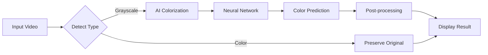

# 🎨 Real-Time Video Colorization System

> **Transform black \& white videos into vibrant colorized content using AI and deep learning!**
***

## 🎯 Project Overview

**Real-Time Video Colorization System** is an AI-powered application that can:

- ✨ **Colorize black \& white videos** in real-time using deep learning
- 🎥 **Process live webcam feeds** with instant colorization
- 🖼️ **Handle both video files and image frames**
- 🎨 **Switch between different colorization models**
- 📱 **User-friendly GUI** for easy interaction
- ⚡ **Real-time processing** with optimized performance


### 🎯 Problem Statement

*"Create a model for colorizing grayscale video frames in real time. The model should be able to process video streams and live webcam feeds. A graphical user interface (GUI) should be provided to display colorized video in real time and allow users to switch between colorization models."*

### ✅ What This Project Does

| **Input** | **Process** | **Output** |
| :-- | :-- | :-- |
| Black \& White Video | AI Colorization | Colorized Video |
| Grayscale Webcam Feed | Real-time Processing | Live Colorized Stream |
| Color Video | Smart Detection | Preserved Original Colors |
| Image Frames | Batch Processing | Colorized Image Sequence |


***

## 🏗️ Project Structure

```
semantic_video_colorization/
├── 📁 src/                          # Core source code
│   ├── __init__.py                  # Package initialization
│   ├── dataset.py                   # Dataset loading and preprocessing
│   ├── inference.py                 # Real-time inference engine
│   ├── train.py                     # Training pipeline
│   └── video_processor.py           # Video processing utilities
│
├── 📁 models/                       # Neural network architectures
│   ├── __init__.py
│   ├── colorization_net.py         # Main colorization models
│   ├── losses.py                    # Loss functions
│   └── utils.py                     # Model utilities
│
├── 📁 config/                       # Configuration files
│   ├── __init__.py
│   └── training_config.py          # Training hyperparameters
│
├── 📁 scripts/                      # Utility scripts
│   ├── download_pretrained.py      # Download pretrained models
│   ├── evaluate_model.py           # Model evaluation
│   └── prepare_data.py             # Data preparation
│
├── 📁 notebooks/                    # Jupyter notebooks
│   ├── 01_data_exploration.ipynb   # Data analysis
│   ├── 02_model_training.ipynb     # Training experiments
│   ├── 03_inference_demo.ipynb     # Demo and testing
│   └── checkpoints/                # Saved model weights
│
├── 📁 data/                         # Dataset directory
│   ├── raw_videos/                  # Original video files
│   ├── processed_frames/            # Extracted frames
│   │   ├── train/
│   │   │   ├── grayscale/          # Training grayscale images
│   │   │   └── color/              # Training color images
│   │   └── validation/
│   │       ├── grayscale/          # Validation grayscale images
│   │       └── color/              # Validation color images
│   └── test_videos/                # Test video files
│
├── 📁 checkpoints/                  # Trained model weights
│   ├── fast_model.pth              # Fast inference model
│   ├── hq_model.pth                # High-quality model
│   └── best_model.pth              # Best performing model
│
├── 📁 screenshots/                  # GUI screenshots output
│
├── 🐍 gui.py                       # Main GUI application
├── 📋 requirements.txt             # Python dependencies
├── 🔧 setup.py                     # Package setup
├── 📖 README.md                    # This file
└── 📄 .gitignore                   # Git ignore rules
```


***

## 🚀 Quick Start

### ⚡ For Impatient Users

```bash
# 1. Clone and setup
git clone https://github.com/SitaGanesh/Real-time-video-colorization.git
cd Real-time-video-colorization
python -m venv venv
venv\Scripts\activate  # Windows
# source venv/bin/activate  # Linux/Mac

# 2. Install and run
pip install -r requirements.txt
python gui.py

# 3. Load a black & white video and watch the magic! ✨
```


***

## 💻 Installation \& Setup

### 📋 Prerequisites

- **Python 3.8+** (3.9 recommended)
- **CUDA-capable GPU** (optional, for faster processing)
- **4GB+ RAM** (8GB+ recommended)
- **Windows 10/11, Linux, or macOS**


### 🔧 Step-by-Step Installation

#### 1️⃣ Clone the Repository

```bash
git clone https://github.com/SitaGanesh/Real-time-video-colorization.git
cd Real-time-video-colorization
```


#### 2️⃣ Create Virtual Environment

**Windows:**

```bash
python -m venv venv
venv\Scripts\activate
```

**Linux/macOS:**

```bash
python3 -m venv venv
source venv/bin/activate
```


#### 3️⃣ Install Dependencies

```bash
# Upgrade pip first
python -m pip install --upgrade pip

# Install all requirements
pip install -r requirements.txt

# For CUDA support (optional)
pip install torch torchvision torchaudio --index-url https://download.pytorch.org/whl/cu118
```


#### 4️⃣ Verify Installation

```bash
python -c "import torch; print(f'PyTorch: {torch.__version__}')"
python -c "import cv2; print(f'OpenCV: {cv2.__version__}')"
```


#### 5️⃣ Download Pretrained Models (Optional)

```bash
python scripts/download_pretrained.py
```


#### 6️⃣ Create Required Directories

```bash
mkdir -p data/raw_videos data/test_videos screenshots checkpoints
```


***

## 📊 Usage Guide

### 🎮 GUI Interface (Recommended for Beginners)

#### **Step 1: Launch the GUI**

```bash
python gui.py
```


#### **Step 2: Choose Processing Mode**

- 🎨 **Demo Mode**: Rule-based colorization (works immediately)
- 🧠 **Neural Mode**: AI model colorization (requires trained model)


#### **Step 3: Load Your Content**

- **📹 Webcam**: Click "Start Webcam" for live processing
- **🎬 Video File**: Click "Load Video" and select your file


#### **Step 4: Watch the Magic!**

- **Black \& White Input** → **Colorized Output** ✨
- **Color Input** → **Preserved Original Colors** 🌈


#### **Step 5: Save Results**

- **📸 Screenshot**: Save current colorized frame
- **💾 Location**: `screenshots/colorized_screenshot_[timestamp].png`


### 📓 Jupyter Notebooks (For Experimentation)

#### **Start Jupyter Lab**

```bash
jupyter lab
```


#### **Navigate to Notebooks**

1. **📊 `01_data_exploration.ipynb`**: Analyze your video data
2. **🏋️ `02_model_training.ipynb`**: Train colorization models
3. **🎯 `03_inference_demo.ipynb`**: Test and demo models

### 🖥️ Command Line Interface

#### **Process Single Video**

```bash
python -m src.inference --input data/test_videos/bw_video.mp4 --output colorized_output.mp4
```


#### **Train New Model**

```bash
python src/train.py --data-dir data/processed_frames --epochs 50 --batch-size 16
```


#### **Evaluate Model**

```bash
python scripts/evaluate_model.py --model checkpoints/best_model.pth --data data/processed_frames
```


***

## 🔧 File Descriptions

### 📁 **Core Source Code (`src/`)**

| File | Purpose | What It Does |
| :-- | :-- | :-- |
| **`dataset.py`** | Data Pipeline | Loads video frames, applies transforms, creates train/val splits |
| **`inference.py`** | Real-time Engine | Processes video streams, handles model inference, performance tracking |
| **`train.py`** | Training Pipeline | Complete training loop, checkpointing, validation, early stopping |
| **`video_processor.py`** | Video Utilities | Extract frames, create videos, format conversions, metadata |

### 🧠 **Models (`models/`)**

| File | Purpose | What It Does |
| :-- | :-- | :-- |
| **`colorization_net.py`** | Neural Networks | U-Net, FastNet, Attention-based colorization architectures |
| **`losses.py`** | Loss Functions | L1, Perceptual, GAN losses for training |
| **`utils.py`** | Model Utilities | Weight initialization, model summaries, utilities |

### ⚙️ **Configuration (`config/`)**

| File | Purpose | What It Does |
| :-- | :-- | :-- |
| **`training_config.py`** | Hyperparameters | Learning rates, batch sizes, model settings, paths |

### 🛠️ **Scripts (`scripts/`)**

| File | Purpose | What It Does |
| :-- | :-- | :-- |
| **`download_pretrained.py`** | Model Downloader | Downloads pretrained weights from online sources |
| **`evaluate_model.py`** | Model Evaluation | Tests model performance, generates metrics, sample outputs |
| **`prepare_data.py`** | Data Preparation | Extracts frames from videos, creates train/val splits |

### 📚 **Notebooks (`notebooks/`)**

| Notebook | Purpose | What You'll Learn |
| :-- | :-- | :-- |
| **`01_data_exploration.ipynb`** | Data Analysis | Video statistics, frame distributions, quality analysis |
| **`02_model_training.ipynb`** | Training Process | Model architecture, training loops, loss visualization |
| **`03_inference_demo.ipynb`** | Testing \& Demo | Model inference, result comparison, performance analysis |

### 🎮 **Main Application**

| File | Purpose | What It Does |
| :-- | :-- | :-- |
| **`gui.py`** | Main Interface | Complete GUI application with real-time video processing |


***

## 🧠 How It Works

### 🔄 **Processing Pipeline**




### 🎯 **Core Algorithm**

1. **🔍 Frame Analysis**: Detect if input is grayscale or color
2. **🎨 Colorization Process** (for grayscale frames):
    - Convert frame to tensor
    - Normalize pixel values
    - Pass through neural network
    - Generate RGB color channels
    - Apply post-processing
3. **📺 Display**: Show colorized result in real-time
4. **💾 Storage**: Save screenshots of colorized frames

### 🧬 **Neural Network Architecture**

```python
Input: Grayscale Frame [1 x H x W]
    ↓
Encoder: Extract Features
    ↓ 
Bottleneck: Process Features
    ↓
Decoder: Generate Colors
    ↓
Output: RGB Frame [3 x H x W]
```


### ⚡ **Performance Optimization**

- **GPU Acceleration**: CUDA support for faster processing
- **Batch Processing**: Process multiple frames simultaneously
- **Memory Management**: Efficient tensor operations
- **Threading**: Separate threads for GUI and processing

***

## 🎮 GUI Interface

### 🖥️ **Main Window Components**

#### **🎛️ Control Panel**

- **📹 Start Webcam**: Begin live camera colorization
- **🎬 Load Video**: Select video file for processing
- **⏹️ Stop**: End current processing
- **📸 Screenshot**: Save current colorized frame
- **🎨 Mode Toggle**: Switch between Demo/Neural modes
- **❌ Exit**: Close application


#### **📺 Video Display**

- **640x480 pixels** main viewing area
- **Real-time preview** of colorization results
- **Status indicators** for current processing state


#### **ℹ️ Status Bar**

- **Processing status**: Current operation state
- **FPS counter**: Real-time performance metrics
- **Debug information**: Technical details for troubleshooting


### 🎨 **Processing Modes**

#### **🎨 Demo Mode**

- **Rule-based colorization** using image analysis
- **No trained model required**
- **Instant results** with basic color assignment
- **Perfect for testing** and demonstrations


#### **🧠 Neural Mode**

- **AI-powered colorization** using trained deep learning models
- **High-quality results** with realistic colors
- **Requires trained model** weights
- **Best for production** use


### 📸 **Screenshot Feature**

- **Automatic saving** to `screenshots/` directory
- **Timestamped filenames** for organization
- **PNG format** for high quality
- **Includes colorized result**, not original grayscale

***

## 📚 Training Your Own Model

### 📊 **Data Preparation**

#### **Step 1: Collect Videos**

```bash
# Place your training videos in:
data/raw_videos/
├── video1.mp4
├── video2.avi
└── video3.mov
```


#### **Step 2: Extract Frames**

```bash
python scripts/prepare_data.py \
    --input data/raw_videos \
    --output data/processed_frames \
    --frame-rate 1.0 \
    --max-frames 500 \
    --target-size 256x256
```


#### **Step 3: Verify Data**

```bash
# Check extracted frames
ls data/processed_frames/train/grayscale/ | wc -l
ls data/processed_frames/train/color/ | wc -l
```


### 🏋️ **Training Process**

#### **Step 1: Configure Training**

Edit `config/training_config.py`:

```python
class TrainingConfig:
    DATA_DIR = 'data/processed_frames'
    BATCH_SIZE = 16
    LEARNING_RATE = 0.0001
    NUM_EPOCHS = 100
    MODEL_NAME = 'ColorizationNet'
```


#### **Step 2: Start Training**

```bash
python src/train.py \
    --data-dir data/processed_frames \
    --epochs 50 \
    --batch-size 16 \
    --model FastColorizationNet
```


#### **Step 3: Monitor Progress**

```bash
# View training logs
tensorboard --logdir logs/
```


#### **Step 4: Evaluate Results**

```bash
python scripts/evaluate_model.py \
    --model checkpoints/best_model.pth \
    --data data/processed_frames
```


### 📈 **Training Tips**

- **🎯 Start Small**: Use 1000-5000 frames for initial experiments
- **⚖️ Balance Data**: Equal amounts of different scene types
- **🔍 Monitor Overfitting**: Use validation loss for early stopping
- **💾 Save Checkpoints**: Regular model saving during training
- **🎨 Visual Inspection**: Check sample colorizations regularly

***

## 🔬 Technical Details

### 🧮 **Model Architectures**

#### **FastColorizationNet**

- **Purpose**: Real-time processing
- **Layers**: 4 encoder + 4 decoder
- **Parameters**: ~2M
- **Speed**: 30+ FPS on GPU
- **Quality**: Good for live streams


#### **ColorizationNet**

- **Purpose**: High-quality results
- **Layers**: 8 encoder + 8 decoder
- **Parameters**: ~15M
- **Speed**: 10-15 FPS on GPU
- **Quality**: Excellent for offline processing


#### **AttentionColorizationNet**

- **Purpose**: State-of-the-art quality
- **Features**: Self-attention mechanisms
- **Parameters**: ~25M
- **Speed**: 5-8 FPS on GPU
- **Quality**: Best possible results


### ⚙️ **System Requirements**

#### **Minimum Requirements**

- **CPU**: Intel i5 / AMD Ryzen 5
- **RAM**: 4GB
- **GPU**: Integrated graphics
- **Storage**: 2GB free space
- **Performance**: 5-10 FPS


#### **Recommended Requirements**

- **CPU**: Intel i7 / AMD Ryzen 7
- **RAM**: 8GB+
- **GPU**: GTX 1060 / RTX 2060 / RTX 3060
- **Storage**: 10GB free space
- **Performance**: 20-30 FPS


#### **Optimal Requirements**

- **CPU**: Intel i9 / AMD Ryzen 9
- **RAM**: 16GB+
- **GPU**: RTX 3080 / RTX 4080 / RTX 4090
- **Storage**: 20GB+ SSD
- **Performance**: 60+ FPS


### 🔧 **Performance Optimization**

#### **GPU Optimization**

```python
# Enable GPU acceleration
device = 'cuda' if torch.cuda.is_available() else 'cpu'
model = model.to(device)

# Mixed precision training
from torch.cuda.amp import autocast, GradScaler
scaler = GradScaler()
```


#### **Memory Management**

```python
# Clear cache regularly
torch.cuda.empty_cache()

# Use efficient data loading
DataLoader(dataset, pin_memory=True, num_workers=4)
```


#### **Inference Optimization**

```python
# Disable gradients for inference
with torch.no_grad():
    output = model(input_tensor)

# Use half precision
model.half()  # Reduce memory usage by 50%
```


***


## 🐛 Troubleshooting

### ❌ **Common Issues \& Solutions**

#### **🚫 "Cannot open webcam"**

```bash
# Solution 1: Check camera permissions
# Windows: Settings → Privacy → Camera
# Linux: ls /dev/video*
# Mac: System Preferences → Security & Privacy

# Solution 2: Try different camera index
camera_idx = 1  # Instead of 0
```


#### **🚫 "Model file not found"**

```bash
# Solution: Download or create model file
python scripts/download_pretrained.py
# Or use demo mode
```


#### **🚫 "CUDA out of memory"**

```python
# Solution: Reduce batch size
BATCH_SIZE = 8  # Instead of 16
# Or use CPU
device = 'cpu'
```


#### **🚫 "Video file cannot be opened"**

```bash
# Solution: Check supported formats
# Supported: .mp4, .avi, .mov, .mkv, .wmv
# Convert if needed:
ffmpeg -i input.video -c:v libx264 output.mp4
```


#### **🚫 "Poor colorization quality"**

```bash
# Solution 1: Use higher quality model
model = 'AttentionColorizationNet'

# Solution 2: Train on similar data
python src/train.py --data-dir your_data

# Solution 3: Adjust preprocessing
target_size = (512, 512)  # Higher resolution
```


### 🔧 **Debug Mode**

#### **Enable Detailed Logging**

```python
import logging
logging.basicConfig(level=logging.DEBUG)
```


#### **Check System Info**

```python
python -c "
import torch, cv2, sys
print(f'Python: {sys.version}')
print(f'PyTorch: {torch.__version__}')
print(f'CUDA: {torch.cuda.is_available()}')
print(f'OpenCV: {cv2.__version__}')
"
```


***

## 📊 Project Statistics

- **📅 Created**: 2025
- **🚀 Version**: 1.0.0
- **📝 Language**: Python 3.8+
- **🧠 Framework**: PyTorch
- **🎨 GUI**: CustomTkinter
- **📹 Video**: OpenCV
- **⭐ Stars**: Growing!

***

## 🔮 Future Roadmap

- [ ] **🎬 Real-time video export** functionality
- [ ] **🌐 Web interface** for browser-based usage
- [ ] **📱 Mobile app** for iOS and Android
- [ ] **☁️ Cloud processing** for high-end models
- [ ] **🎨 Style transfer** integration
- [ ] **🤖 Automatic model selection** based on content
- [ ] **📈 Advanced metrics** and quality assessment
- [ ] **🔄 Batch video processing** for multiple files

***

<div align="center">

### 🎉 **Ready to Start Colorizing?**

```bash
git clone https://github.com/SitaGanesh/Real-time-video-colorization.git
cd Real-time-video-colorization
pip install -r requirements.txt
python gui.py
```


</div>

***

Happy Colorizing

***
*Made with ❤️ by the Sita Ganesh*

